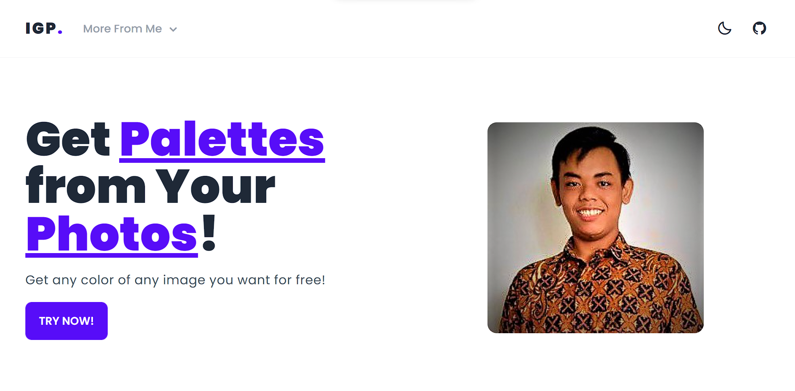

<p align="center">
   
</p>

<!-- Garis Lurus -->
 
<!-- End -->

<h1 align="center">IMAGE GET PALETTE</h1>
<!-- Garis Lurus -->
 
<!-- End -->


<!-- Garis Lurus -->
 
<!-- End -->

 ## ✅ About 
 > ### This website is a website for generating colors/palettes from inputted images.


<!-- Garis Lurus -->
 
<!-- End -->

## 👦🏽 Siapa pembuat aplikasi ini?

| Profile        |  Keterangan                      |
|----------------|----------------------------------|
| Nama           | Bagus Budi Satoto                |
| Jurusan        | S1 - Informatika                 |
| Kampus         | Universitas Amikom Yogyakarta    |

<!-- Garis Lurus -->
 
<!-- End -->

## 📊 Languages and Tools
<br>

- [HTML](https://developer.mozilla.org/en-US/docs/Web/HTML)

- [CSS](https://developer.mozilla.org/en-US/docs/Web/CSS)

- [Javascript](https://developer.mozilla.org/en-US/docs/Web/JavaScript)

- [Git](https://git-scm.com/)

- [vs-code](https://code.visualstudio.com/)


<!-- Garis Lurus -->
 
<!-- End -->

## 🔗 Cara Install
<br>

- <code>git clone ↆↆ </code>
  
  ```bash
  git clone https://github.com/bagussatoto/image-get-palette.git
  ``` 
  
- <code>cd image get palette</code>
- <code>npm install</code>
- <code>npm run dev</code>

<!-- Garis Lurus -->
 
<!-- End -->


##  🚫 Demo 
- 🚫 [Demo](https://imagetopalette.netlify.app/)


<!-- Garis Lurus -->
 
<!-- End -->


## 📌 Request Fitur Baru dan Pelaporan Bug

Anda dapat meminta fitur baru maupun melaporkan bug melalui menu [**issues**](https://github.com/bagussatoto/image-get-palette/issues) yang sudah disediakan oleh GitHub (lihat menu di atas), posting issues baru dan kita akan berdiskusi disana.

<!-- Garis Lurus -->
 
<!-- End -->

## 🛒 Berkontribusi

Siapapun dapat berkontribusi pada proyek ini mulai dari pemrograman, pembuakan buku manual, sampai dengan mengenalkan produk ini kepada mahasiswa 
untuk belajar agar mengurangi kesenjangan pendidikan teknologi dengan cara membuat postingan issue di repository ini.

<!-- Garis Lurus -->
 
<!-- End -->

> 🧑🏽‍💻 | [BAGUS BUDI SATOTO ](http://github.com/bagussatoto)
<br>

